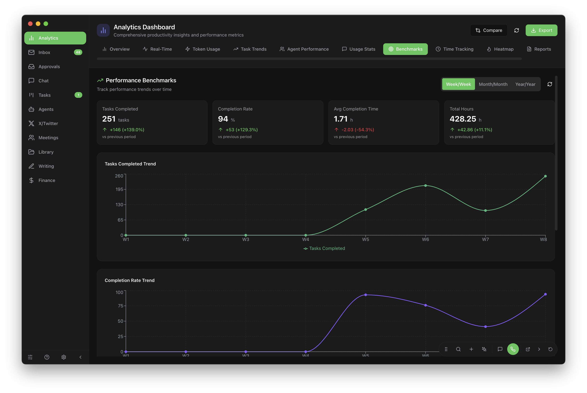

# Froggo-AI

[](https://github.com/ProfFroggo/Froggo-AI/actions/workflows/tests.yml)
[](https://www.gnu.org/licenses/agpl-3.0)

Electron desktop app for managing a multi-agent AI platform. Task tracking, agent orchestration, communications, and analytics in one place.

## Screenshots

### Agent Management


### Task Board


### Analytics


### Chat


## Features

- **Chat** — Real-time conversations with 13+ AI agents via OpenClaw gateway
- **Kanban Board** — Drag-and-drop task management (Todo > In Progress > Review > Done)
- **Agent Management** — Spawn, monitor, and manage AI agent sessions
- **Inbox** — Unified inbox across Discord, Telegram, WhatsApp, and web
- **Calendar** — Multi-account calendar with content scheduling
- **Analytics** — Token usage, task completion rates, agent activity
- **Voice** — Live voice chat via Gemini
- **X/Twitter** — Content drafting, scheduling, and posting

## Design System

Froggo uses a centralized design token system for consistent UI across all components.

### Design Tokens

All design tokens are defined in `src/design-tokens.css` and cover:

- **Spacing**: Inline, stack, component, and section spacing
- **Typography**: Font sizes, weights, line heights, letter spacing
- **Colors**: Surface, text, accent, semantic (success/error/warning/info)
- **Interactive States**: Hover, active, disabled, focus
- **Borders & Shadows**: Radius tokens and elevation levels
- **Component Sizes**: Icons, buttons, inputs, avatars, badges
- **Transitions**: Durations and easing functions
- **Z-index Scale**: Layering for dropdowns, modals, tooltips

### Using Design Tokens

```tsx
// Use CSS variables in components
<div style={{ 
  padding: 'var(--space-component)',
  backgroundColor: 'var(--clawd-surface)',
  borderRadius: 'var(--radius)'
}}>
  <h2 style={{ fontSize: 'var(--text-heading)' }}>
    Title
  </h2>
</div>

// Or use semantic utility classes
<div className="text-heading-2 bg-success border-success">
  Success message
</div>
```

### Component Patterns

**Spacing:**
- Use `--space-inline` for icon+text gaps
- Use `--space-stack` for vertical lists
- Use `--space-component` for card/panel padding
- Use `--space-section` between major sections

**Colors:**
- Use `--clawd-bg` for page backgrounds
- Use `--clawd-surface` for cards and panels
- Use `--clawd-accent` for primary actions
- Use semantic colors (`--color-success`, `--color-error`, etc.) for status

**Typography:**
- Use `--text-heading` for section titles
- Use `--text-body` for standard content
- Use `--text-small` for metadata
- Use utility classes (`.text-heading-2`, `.text-secondary`)

**Interactive States:**
- Apply `focus-ring` class for keyboard navigation
- Use `--color-hover` for hover states
- Use transition tokens for smooth animations

### Theme Support

The design system includes both dark (default) and light themes. Theme switching is automatic via `:root.light` class.

### For Contributors

**Setup:**
1. Design tokens are imported in `src/index.css`
2. Never hardcode colors or spacing — always use tokens
3. Check `src/design-tokens.css` for available tokens before adding new values
4. Use Tailwind classes when they map to design tokens
5. For custom styles, prefer CSS variables over inline hex values

**Adding New Tokens:**
If you need a new token:
1. Check if an existing token works first
2. Add it to the appropriate section in `design-tokens.css`
3. Use semantic naming (purpose over value)
4. Add both dark and light theme values if needed
5. Document usage in comments

**Component Best Practices:**
- Start with semantic HTML
- Apply design tokens via CSS variables or utility classes
- Keep spacing consistent (use token scale)
- Test in both dark and light themes
- Ensure focus states work for keyboard navigation

See [`src/design-tokens.css`](src/design-tokens.css) for the complete token reference.

## Tech Stack

- Electron + React + TypeScript
- Tailwind CSS + Design Tokens
- Zustand (state management)
- SQLite (froggo-db)
- Vite

## Development

```bash
npm install
npm run electron:dev    # Dev with hot reload
npm run test:run        # Run tests
npm run build:dev       # Dev build
npm run build:prod      # Production build
```

## License

AGPL-3.0 — see [LICENSE](LICENSE)
