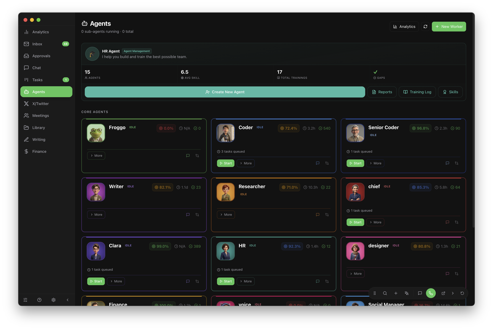
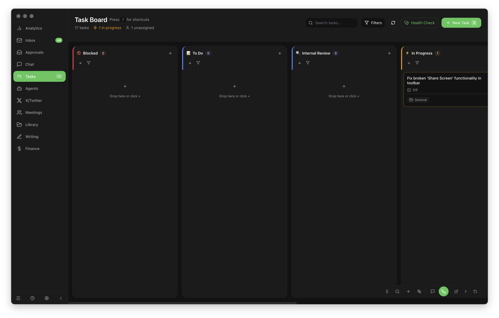
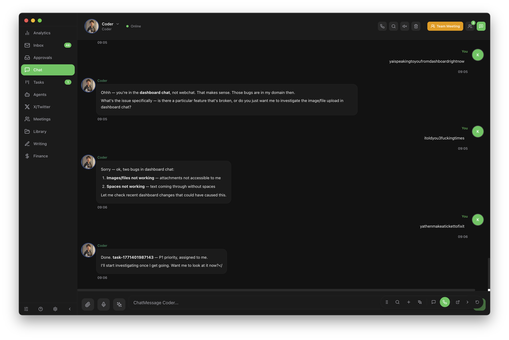

# Froggo-AI

[](https://github.com/ProfFroggo/Froggo-AI/actions/workflows/tests.yml)
[](https://www.gnu.org/licenses/agpl-3.0)

Electron desktop app for managing a multi-agent AI platform. Task tracking, agent orchestration, communications, and analytics in one place.

## Screenshots

### Agent Management


### Task Board


### Chat


## Features

- **Chat** — Real-time conversations with 13+ AI agents via OpenClaw gateway
- **Kanban Board** — Drag-and-drop task management (Todo > In Progress > Review > Done)
- **Agent Management** — Spawn, monitor, and manage AI agent sessions
- **Inbox** — Unified inbox across Discord, Telegram, WhatsApp, and web
- **Calendar** — Multi-account calendar with content scheduling
- **Analytics** — Token usage, task completion rates, agent activity
- **Voice** — Live voice chat via Gemini
- **X/Twitter** — Content drafting, scheduling, and posting

## Tech Stack

- Electron + React + TypeScript
- Tailwind CSS
- Zustand (state management)
- SQLite (froggo-db)
- Vite

## Development

```bash
npm install
npm run electron:dev    # Dev with hot reload
npm run test:run        # Run tests
npm run build:dev       # Dev build
npm run build:prod      # Production build
```

## License

AGPL-3.0 — see [LICENSE](LICENSE)
