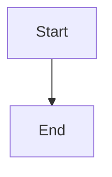

# Artifact Panel System

## Overview

The Artifact Panel System is a comprehensive solution for capturing, displaying, and managing artifacts (code blocks, images, diagrams, data, files) from chat conversations. It provides automatic extraction, version history, and a rich UI for browsing and interacting with generated content.

## Features

- **Automatic Extraction**: Automatically detects and extracts artifacts from chat messages
- **Multiple Artifact Types**: Supports code, images, diagrams (Mermaid), JSON data, tables, and files
- **Version History**: Tracks changes to artifacts over time with ability to revert
- **State Persistence**: Artifacts are persisted across sessions using Zustand + localStorage
- **Rich UI**: Collapsible panel with tabs, preview, copy, download, and delete actions
- **Session Filtering**: Filter artifacts by session/chat context
- **Search**: Search artifacts by title, content, or tags

## Architecture

### Components

```
src/
├── store/
│   └── artifactStore.ts         # Zustand store for artifact state
├── utils/
│   └── artifactExtractor.ts     # Extraction logic for different artifact types
├── hooks/
│   └── useArtifactExtraction.ts # Hook for integrating with messages
└── components/
    └── ArtifactPanel.tsx        # Main UI component
```

### Data Flow

1. **Message Received** → Chat component receives new message
2. **Detection** → `containsArtifacts()` checks if message has extractable content
3. **Extraction** → `extractAllArtifacts()` parses and extracts artifacts
4. **Storage** → Artifacts stored in Zustand store (auto-persisted)
5. **Display** → ArtifactPanel component renders from store state

## Usage

### Basic Integration

```typescript
import ArtifactPanel from './components/ArtifactPanel';
import { useArtifactExtraction } from './hooks/useArtifactExtraction';

function ChatView() {
  const messages = useChatStore((s) => s.messages);
  const sessionId = 'current-session-id';
  
  // Automatically extract artifacts from messages
  useArtifactExtraction(messages, sessionId, {
    autoExtract: true,
    extractFromAssistant: true,
    extractFromUser: false, // Only extract from AI responses
  });

  return (
    <div className="flex h-screen">
      <div className="flex-1">
        {/* Your chat UI */}
      </div>
      <ArtifactPanel />
    </div>
  );
}
```

### Manual Extraction

```typescript
import { useArtifactExtraction } from './hooks/useArtifactExtraction';

function MessageActions({ message }) {
  const { extractManually } = useArtifactExtraction(messages, sessionId);
  
  const handleExtract = () => {
    const artifacts = extractManually(message.id);
    console.log(`Extracted ${artifacts.length} artifacts`);
  };
  
  return (
    <button onClick={handleExtract}>
      Extract Artifacts
    </button>
  );
}
```

### Direct Store Access

```typescript
import { useArtifactStore } from './store/artifactStore';

function CustomArtifactManager() {
  const {
    artifacts,
    addArtifact,
    deleteArtifact,
    addVersion,
    getFilteredArtifacts,
  } = useArtifactStore();

  // Add custom artifact
  const addCustom = () => {
    addArtifact({
      type: 'code',
      title: 'My Script',
      content: 'console.log("Hello");',
      messageId: 'msg-123',
      sessionId: 'session-abc',
      timestamp: Date.now(),
      metadata: { language: 'javascript' },
    });
  };

  // Add new version
  const updateArtifact = (id: string, newContent: string) => {
    addVersion(id, newContent, 'msg-124', 'Fixed bug');
  };

  return (
    <div>
      <button onClick={addCustom}>Add Artifact</button>
      {/* Custom UI */}
    </div>
  );
}
```

## Artifact Types

### Code Blocks

Extracted from markdown code fences:

````markdown
```python
def hello():
    print("Hello, world!")
```
````

**Metadata**: `language`, `filename` (from comment)

### Images

Extracted from markdown image syntax:

```markdown

```

**Metadata**: `filename`

### Diagrams

Extracted from Mermaid blocks:

````markdown

````

**Metadata**: `language: 'mermaid'`

### JSON Data

Extracted from JSON code blocks:

````markdown
```json
{
  "name": "example",
  "value": 42
}
```
````

**Metadata**: `language: 'json'`, `mimeType: 'application/json'`

### Files

Extracted from special HTML comment markers:

```html
<!-- FILE: config.yaml -->
server:
  port: 8080
<!-- /FILE -->
```

**Metadata**: `filename`, `size`

### Tables

Extracted from markdown tables:

```markdown
| Name | Age |
|------|-----|
| John | 30  |
```

**Metadata**: `mimeType: 'text/markdown'`

## Version History

Artifacts automatically track versions when content changes:

```typescript
const artifact = {
  id: 'artifact-123',
  currentVersion: 3,
  versions: [
    { version: 1, content: 'v1', timestamp: 1000, messageId: 'msg-1' },
    { version: 2, content: 'v2', timestamp: 2000, messageId: 'msg-2' },
    { version: 3, content: 'v3', timestamp: 3000, messageId: 'msg-3', changeDescription: 'Bug fix' },
  ]
};
```

### Reverting to Previous Version

```typescript
const { revertToVersion } = useArtifactStore();

// Revert to version 2
revertToVersion('artifact-123', 2);
```

## State Management

### Store Structure

```typescript
interface ArtifactState {
  artifacts: Artifact[];
  selectedArtifactId: string | null;
  isCollapsed: boolean;
  filterBySession: string | null;
  searchQuery: string;
}
```

### Persistence

The store uses Zustand's `persist` middleware to save artifacts to localStorage:

- **Key**: `artifact-storage`
- **Persisted**: `artifacts`, `isCollapsed`
- **Transient**: `selectedArtifactId`, `filterBySession`, `searchQuery`

### Actions

```typescript
// Adding artifacts
addArtifact(artifact: Omit<Artifact, 'id' | 'versions' | 'currentVersion'>)

// Updating artifacts
updateArtifact(id: string, updates: Partial<Artifact>)

// Deleting artifacts
deleteArtifact(id: string)
clearArtifacts()
clearSessionArtifacts(sessionId: string)

// Versioning
addVersion(artifactId: string, content: string, messageId: string, changeDescription?: string)
revertToVersion(artifactId: string, version: number)
getVersionHistory(artifactId: string): ArtifactVersion[]

// UI state
selectArtifact(id: string | null)
toggleCollapse()
setCollapsed(collapsed: boolean)
setFilterBySession(sessionId: string | null)
setSearchQuery(query: string)

// Getters
getArtifact(id: string): Artifact | undefined
getSessionArtifacts(sessionId: string): Artifact[]
getFilteredArtifacts(): Artifact[]
```

## Extraction Utilities

### Main Function

```typescript
import { extractAllArtifacts } from './utils/artifactExtractor';

const artifacts = extractAllArtifacts(messageContent);
// Returns: ExtractedArtifact[]
```

### Individual Extractors

```typescript
import {
  extractCodeBlocks,
  extractImages,
  extractDiagrams,
  extractJSON,
  extractTables,
  extractFiles,
} from './utils/artifactExtractor';

// Extract specific types
const codeBlocks = extractCodeBlocks(content);
const images = extractImages(content);
const diagrams = extractDiagrams(content);
```

### Detection

```typescript
import { containsArtifacts } from './utils/artifactExtractor';

if (containsArtifacts(message.content)) {
  // Process artifacts
}
```

### Title Generation

```typescript
import { generateArtifactTitle } from './utils/artifactExtractor';

const title = generateArtifactTitle(extractedArtifact);
// Generates smart titles based on content (function names, filenames, etc.)
```

## UI Components

### ArtifactPanel

Main panel component with full UI:

```typescript
import ArtifactPanel from './components/ArtifactPanel';

<ArtifactPanel />
```

Features:
- Collapsible side panel (48px collapsed, 384px expanded)
- Artifact tabs with type icons and version badges
- Content preview with syntax highlighting
- Toolbar: copy, download, version history, delete
- Version history dropdown with revert functionality
- Empty state when no artifacts

### Styling

Uses Clawd design tokens:
- `clawd-bg`: Background color
- `clawd-surface`: Surface color (elevated backgrounds)
- `clawd-border`: Border color
- `clawd-text`: Primary text
- `clawd-text-dim`: Secondary text
- `clawd-accent`: Accent/primary color

## Performance Considerations

### Automatic Extraction

The `useArtifactExtraction` hook uses:
- `useRef` to track processed messages (prevents re-extraction)
- Content comparison to detect actual changes
- Dependency array optimization

### Large Artifacts

For large code files or data:
- Consider lazy loading content in the preview
- Add pagination for version history
- Implement virtual scrolling for artifact list

### Storage Limits

localStorage has ~5MB limit. Consider:
- Setting max artifacts per session
- Auto-cleaning old artifacts
- Compressing content before storage
- Moving to IndexedDB for larger datasets

## Examples

### Example 1: Chat Integration

```typescript
import { useArtifactExtraction } from './hooks/useArtifactExtraction';
import ArtifactPanel from './components/ArtifactPanel';
import { useChatStore } from './store/chatStore';

function ChatInterface() {
  const messages = useChatStore((s) => s.messages);
  const sessionId = useChatStore((s) => s.currentSessionId);

  useArtifactExtraction(messages, sessionId);

  return (
    <div className="flex h-screen">
      <div className="flex-1 flex flex-col">
        <ChatHeader />
        <MessageList messages={messages} />
        <ChatInput />
      </div>
      <ArtifactPanel />
    </div>
  );
}
```

### Example 2: Custom Artifact Button

```typescript
import { useArtifactDetection } from './hooks/useArtifactExtraction';

function MessageItem({ message }) {
  const { hasArtifacts, count } = useArtifactDetection(message);

  return (
    <div className="message">
      <div>{message.content}</div>
      {hasArtifacts && (
        <button className="text-xs text-blue-500">
          📎 {count} artifact{count > 1 ? 's' : ''}
        </button>
      )}
    </div>
  );
}
```

### Example 3: Programmatic Artifact Creation

```typescript
import { useArtifactStore } from './store/artifactStore';

function CodeEditor() {
  const addArtifact = useArtifactStore((s) => s.addArtifact);

  const saveAsArtifact = (code: string, filename: string) => {
    addArtifact({
      type: 'code',
      title: filename,
      content: code,
      messageId: 'editor-save',
      sessionId: 'editor',
      timestamp: Date.now(),
      metadata: {
        language: filename.split('.').pop(),
        filename,
        size: code.length,
      },
      tags: ['user-created', 'editor'],
    });
  };

  return (
    <div>
      {/* Editor UI */}
      <button onClick={() => saveAsArtifact(code, 'script.js')}>
        Save as Artifact
      </button>
    </div>
  );
}
```

## Testing

### Unit Tests (Example)

```typescript
import { describe, it, expect } from 'vitest';
import { extractCodeBlocks, extractImages } from './utils/artifactExtractor';

describe('Artifact Extraction', () => {
  it('should extract code blocks', () => {
    const content = '```javascript\nconsole.log("hi");\n```';
    const artifacts = extractCodeBlocks(content);
    
    expect(artifacts).toHaveLength(1);
    expect(artifacts[0].type).toBe('code');
    expect(artifacts[0].metadata?.language).toBe('javascript');
  });

  it('should extract images', () => {
    const content = '';
    const artifacts = extractImages(content);
    
    expect(artifacts).toHaveLength(1);
    expect(artifacts[0].type).toBe('image');
    expect(artifacts[0].content).toBe('https://example.com/image.png');
  });
});
```

## Future Enhancements

- [ ] Artifact export (ZIP download of all artifacts)
- [ ] Artifact sharing (generate shareable links)
- [ ] Diff view between versions
- [ ] Artifact templates (reusable code snippets)
- [ ] AI-powered artifact suggestions
- [ ] Collaborative editing
- [ ] Cloud sync across devices
- [ ] Rich preview for more file types (PDF, video, etc.)
- [ ] Artifact collections/folders
- [ ] Full-text search with highlighting

## Troubleshooting

### Artifacts not appearing

1. Check that `useArtifactExtraction` is called with correct messages
2. Verify `autoExtract` is enabled
3. Check role filters (`extractFromAssistant`, `extractFromUser`)
4. Ensure message content matches extraction patterns

### Panel not persisting state

1. Check browser localStorage quota
2. Verify Zustand persist middleware is configured
3. Check for localStorage errors in console

### Version history not updating

1. Ensure content actually changed (exact string comparison)
2. Verify `addVersion` is called with correct artifact ID
3. Check that messageId is unique for each version

## License

Part of the Froggo Dashboard project.
