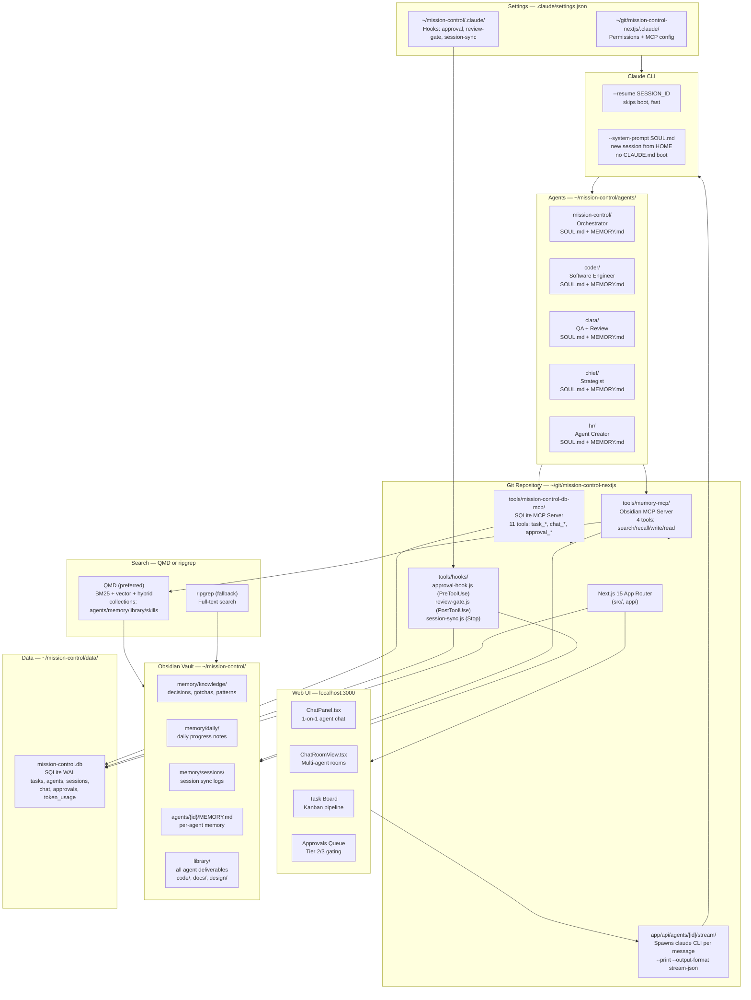

# Mission Control — System Architecture

## Mermaid Diagram



## Key Flows

### Chat Message Flow
1. UI (ChatPanel) POST → `/api/agents/[id]/stream`
2. Route checks `globalThis._agentSessions` for existing session
3. If session exists → `claude --resume SESSION_ID` (fast, ~2s)
4. If new → `claude --print --system-prompt SOUL.md` from HOME (no boot sequence)
5. CLI streams JSON events → SSE to browser
6. Agent calls MCP tools mid-stream (task_*, memory_write, etc.)
7. On result event: session ID saved to DB + in-memory map
8. After every turn: agent writes to memory vault via `memory_write`

### Memory Write Flow
- Agent calls `mcp__memory__memory_write { category, title, content }`
- MCP routes: decision/gotcha/pattern → `memory/knowledge/`, daily → `memory/daily/`, agent → `agents/{id}/`
- QMD auto-indexes on next search or session-sync hook

### Task Pipeline
```
todo → internal-review → in-progress → agent-review → done
             ↕                              ↕
        human-review                  human-review
     (needs human input)         (external dependency)
```
- Clara gates `internal-review` before work begins
- `review-gate.js` hook fires on every task_update to trigger Clara review
- **`blocked` does not exist** — use `human-review` instead

## Core Directory Map

```
~/mission-control/
├── agents/          ← agent workspaces (SOUL, MEMORY, tasks, deliverables)
├── data/            ← SQLite DB (NOT indexed by search)
├── library/         ← all agent output files (indexed)
├── logs/            ← runtime logs (NOT indexed)
├── memory/          ← Obsidian vault core (indexed)
│   ├── knowledge/   ← decisions, gotchas, patterns, architecture
│   ├── daily/       ← daily progress notes
│   ├── sessions/    ← session sync logs from Stop hook
│   ├── agents/      ← agent memory files (Obsidian)
│   └── templates/   ← note templates
├── skills/          ← shared skill files (indexed)
└── .claude/         ← hooks config

~/git/mission-control-nextjs/
├── app/api/         ← Next.js API routes
├── src/components/  ← React UI components
├── src/store/       ← Zustand state
├── tools/
│   ├── mission-control-db-mcp/  ← SQLite MCP server
│   ├── memory-mcp/              ← Obsidian/QMD MCP server
│   └── hooks/                   ← Claude CLI hooks
└── .claude/settings.json        ← MCP + permissions config
```

## MCP Tools Available to All Agents

### mission-control_db
- `task_list`, `task_create`, `task_update`, `task_add_activity`
- `subtask_create`, `subtask_update`
- `chat_post`, `chat_read`, `chat_rooms_list`
- `approval_create`, `approval_check`
- `agent_status`

### memory
- `memory_search` — BM25/vector/hybrid across all of ~/mission-control/
- `memory_recall` — recent notes by topic + recency
- `memory_write` — write to vault (decision/gotcha/pattern/daily/agent)
- `memory_read` — read specific vault file by path
